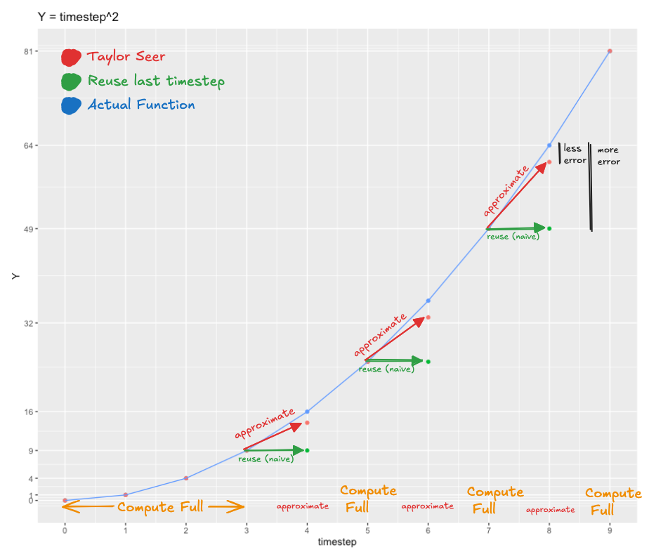

# TaylorSeer
This repo contains an implementation of the Taylor Seer feature caching algorithm, introduced in the paper [From Reusing to Forecasting: Accelerating Diffusion Models with TaylorSeers](https://arxiv.org/abs/2503.06923). This implementation matches the [official implementation](https://github.com/Shenyi-Z/TaylorSeer) by the authors, but is meant to be more self contained.

This repo provides a decorator `taylor_seer` that can be used to wrap any nn.Module that produces a single tensor output. The decorator will track the output of the model as a function of the timestep, and use this information to approximate the output of the model on timesteps where you want to skip the actual computing of $f$.

## Installation
```bash
pip install git+https://github.com/alexarmbr/TaylorSeer.git
```

## Overview
TaylorSeer is a feature caching algorithm that accelerates neural network forward passes by using Taylor series approximations. Like the many other activation caching algorithms out there, it's particularly effective for diffusion models where many similar forward passes are computed in sequence.

### Why its cool

At Replicate, we have spent a lot of time experimenting with feature caching algorithms, and have found that they are a powerful tool for post training acceleration of diffusion models. Taylor Seer is currently my favorite one, because it introduces a novel idea of feature forecasting, rather than just reusing features from previous timesteps.

When running a stable diffusion model, you are repeatedly computing a function $f$ over many timesteps, i.e. $y_0=f(x_0)$, $y_1=f(x_1)$, $y_2=f(x_2)$, ..., $f$ may be a linear layer, attention kernel, or a large transformer block composed of many sub layers. The idea of Taylor Seer is to track how the output of $f$ changes as function of the timestep using a taylor series expansion, and use this taylor series expansion to approximate the output of $f$ on timesteps where you want to skip the actual computing of $f$.

## Usage
```python
import torch
import torch.nn as nn
from taylor_seer import taylor_seer

@taylor_seer(warmup_steps=4, skip_interval_steps=2, n_derivatives=1)
class timestep_squared(nn.Module):
    
    def forward(self, timestep):
        return timestep**2

model = timestep_squared()
model.reset_cache(warmup_steps=4, skip_interval_steps=2)

for i in range(10):
    timestep = torch.tensor(i, dtype=torch.float32)
    output = model(timestep)
    print(f"timestep: {timestep}, output: {output}")

# timestep: 0.0, output: 0.0 (computed)
# timestep: 1.0, output: 1.0 (computed)
# timestep: 2.0, output: 4.0 (computed)
# timestep: 3.0, output: 9.0 (computed)
# timestep: 4.0, output: 14.0 (under estimated)
# timestep: 5.0, output: 25.0 (computed)
# timestep: 6.0, output: 33.0 (under estimated)
# timestep: 7.0, output: 49.0 (computed)
# timestep: 8.0, output: 61.0 (under estimated)
# timestep: 9.0, output: 81.0 (computed)

```
## Explanation
The code above uses the `@taylor_seer` decorator to wrap the `timestep_squared` class, this class is computing the square of whatever input it recieves. The arguments `warmup_steps=4`, `skip_interval_steps=2`, tell the decorator to compute the full output of the model for the first 4 timesteps, and then for all remaining timesteps alternate between returning the taylor series approximation, and computing the full output of the model. The `n_derivatives=1` argument tells the model to only keep track of the first derivative. Notice how the approximation slightly underestimates the $f(t)=t^2$ curve. This is because when we approximate the value at timestep $t$ we are using a taylor series expansion that is centered around the value at a previous timestep. This means we are always slightly underestimating the value at timestep $t$, since $f'(t)=2t$ increases with $t$. But actively predicting the value of the model is still much better than just reusing the output from the previous timestep. (illustrated below)



This is a toy example, but this works surprisingly well when $f$ is a complicated function such as a transformer block. After trying this on a couple stable diffusion models, it seems to work better than other feature caching algorithms, in terms of reducing inference latency without sacrificing too much image quality. I think it generally performs better because the forecasting approach allows you to use it more aggressively than existing feature caching algorithms that reuse rather than forecast.

## TODO:
- [ ] implement an 'auto' mode that automatically decides whether to cache or compute full
